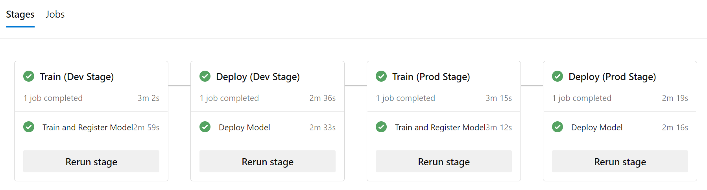

# Multi-stage, multi-enviroment Pipelines

This folder contains a typical DEV-to-PROD release pipeline in [`german-credit-rollout.yml`](german-credit-rollout.yml).

This enables the following flow, where a model is trained, tested and deployed in a development environment. Once that has been completed successfully, the same process is repeated in the production environment:

* Dev Stage
  * Train and register model (in Dev environment)
  * Deploy model (in Dev environment)
* Prod Stage (after Dev Stage completed successfully)
  * Train and register model (in Prod environment)
  * Deploy model (in Prod environment)
